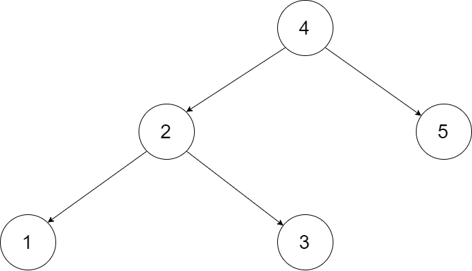
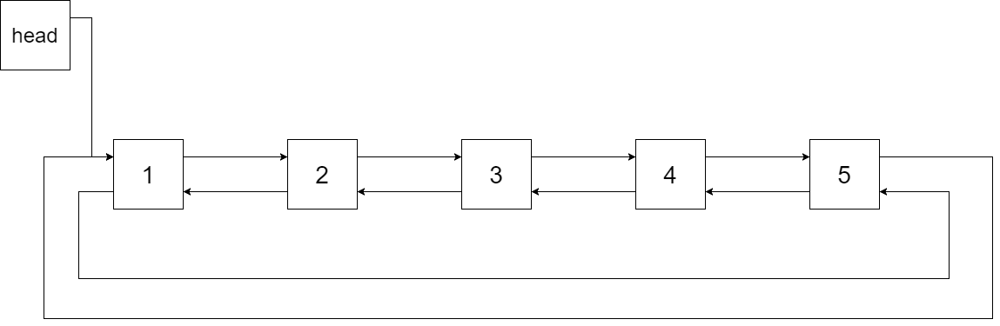
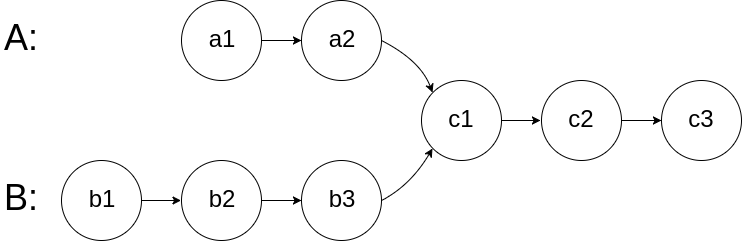
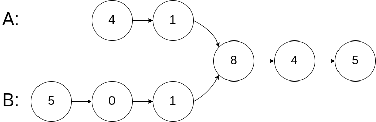
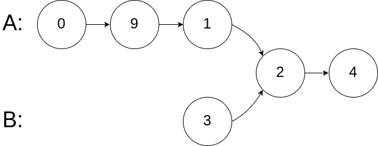
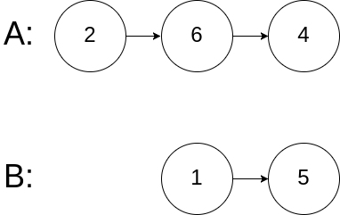
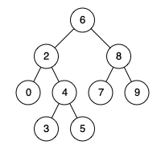
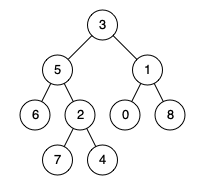

# [面试题 03. 数组中重复的数字](https://leetcode-cn.com/problems/shu-zu-zhong-zhong-fu-de-shu-zi-lcof/)

## 题目描述

找出数组中重复的数字。

在一个长度为 n 的数组 nums 里的所有数字都在 0 ～ n-1 的范围内。数组中某些数字是重复的，但不知道有几个数字重复了，也不知道每个数字重复了几次。请找出数组中任意一个重复的数字。

**示例 1：**

```
输入：
[2, 3, 1, 0, 2, 5, 3]
输出：2 或 3
```

**限制：**

```
2 <= n <= 100000
```

## 解法

三种方式

- 排序
    - 先排序，将相同的数字聚集到一起。
    - 再遍历，当位于 `i` 与 `i + 1` 的数字相等时，返回该数字。
- 哈希表
    - 记录数字在数组中的数量，当数量为 2 时，返回即可。
- 原地交换
    - 0 ～ n-1 范围内的数，分别还原到对应的位置上，如：数字 2 交换到下标为 2 的位置。
    - 若交换过程中发现重复，则直接返回。

# [面试题 04. 二维数组中的查找](https://leetcode-cn.com/problems/er-wei-shu-zu-zhong-de-cha-zhao-lcof/)

## 题目描述

在一个 n \* m 的二维数组中，每一行都按照从左到右递增的顺序排序，每一列都按照从上到下递增的顺序排序。请完成一个函数，输入这样的一个二维数组和一个整数，判断数组中是否含有该整数。

**示例:**

现有矩阵 matrix 如下：

```
[
  [1,   4,  7, 11, 15],
  [2,   5,  8, 12, 19],
  [3,   6,  9, 16, 22],
  [10, 13, 14, 17, 24],
  [18, 21, 23, 26, 30]
]
```

给定 target = 5，返回  `true`。

给定  target = 20，返回  `false`。

**限制：**

- `0 <= n <= 1000`

- `0 <= m <= 1000`

## 解法

- 换一种观察角度，以右上角位置为基点，往左数值逐渐变小，往下数值逐渐变大。
- 且该角度放在数组任意位置都成立，相当于模拟了一棵**二叉搜索树（Binary Search Tree）**。
- 根据二叉搜索树特点，从右上角（或左下角）开始查找即可。

# [面试题 05. 替换空格](https://leetcode-cn.com/problems/ti-huan-kong-ge-lcof/)

## 题目描述

请实现一个函数，把字符串 `s` 中的每个空格替换成"%20"。

**示例 1：**

```
输入：s = "We are happy."
输出："We%20are%20happy."
```

**限制：**

- `0 <= s 的长度 <= 10000`

## 解法

- 使用 `replace()` 替换。
- 遍历添加。

# [面试题 06. 从尾到头打印链表](https://leetcode-cn.com/problems/cong-wei-dao-tou-da-yin-lian-biao-lcof/)

## 题目描述

输入一个链表的头节点，从尾到头反过来返回每个节点的值（用数组返回）。

**示例 1：**

```
输入：head = [1,3,2]
输出：[2,3,1]
```

**限制：**

- `0 <= 链表长度 <= 10000`

## 解法

该题需要将链表转换为数组，且需要反向。由于目标是链表，无法第一时间得知长度，声明等长数组。

解题方案：
- 遍历
  - 从头到尾遍链表，获取链表长度，声明等长数组；
  - 再次遍历并放入数组当中，在数组中的放置顺序是从尾到头。
- 递归
  - 记录深度，递归到链表尾部；
  - 将深度化为数组长度，将回溯结果正序放入数组当中。
- 动态数组
  - 遍历链表，将元素放入数组当中；
  - 遍历结束，将数组倒置后返回（`reverse()`）。

# [面试题 07. 重建二叉树](https://leetcode-cn.com/problems/zhong-jian-er-cha-shu-lcof/)

## 题目描述

输入某二叉树的前序遍历和中序遍历的结果，请重建该二叉树。假设输入的前序遍历和中序遍历的结果中都不含重复的数字。

例如，给出

```
前序遍历 preorder = [3,9,20,15,7]
中序遍历 inorder = [9,3,15,20,7]
```

返回如下的二叉树：

```
    3
   / \
  9  20
    /  \
   15   7
```

**限制：**

- `0 <= 节点个数 <= 5000`

## 解法

# [面试题 09. 用两个栈实现队列](https://leetcode-cn.com/problems/yong-liang-ge-zhan-shi-xian-dui-lie-lcof/)

## 题目描述

用两个栈实现一个队列。队列的声明如下，请实现它的两个函数 `appendTail` 和 `deleteHead` ，分别完成在队列尾部插入整数和在队列头部删除整数的功能。(若队列中没有元素，`deleteHead`  操作返回 -1 )

**示例 1：**

```
输入：
["CQueue","appendTail","deleteHead","deleteHead"]
[[],[3],[],[]]
输出：[null,null,3,-1]
```

**示例 2：**

```
输入：
["CQueue","deleteHead","appendTail","appendTail","deleteHead","deleteHead"]
[[],[],[5],[2],[],[]]
输出：[null,-1,null,null,5,2]
```

**提示：**

- `1 <= values <= 10000`
- `最多会对 appendTail、deleteHead 进行 10000 次调用`

## 解法

- 两个栈，一个负责**输入**，一个负责**输出**；
- 执行输入时，只放入输入栈中；
- 执行输出时，将输入栈的所有元素依次出栈，放入输出栈中；
- 根据栈的特点，处于输入栈**栈底**的元素，在输出栈中便是**栈顶**；
- 只有输出栈中没有元素时才进行倒放，而非每一次。

# [面试题 10- I. 斐波那契数列](https://leetcode-cn.com/problems/fei-bo-na-qi-shu-lie-lcof/)

## 题目描述

写一个函数，输入 `n` ，求斐波那契（Fibonacci）数列的第 `n` 项。斐波那契数列的定义如下：

```
F(0) = 0,   F(1) = 1
F(N) = F(N - 1) + F(N - 2), 其中 N > 1.
```

斐波那契数列由 0 和 1 开始，之后的斐波那契数就是由之前的两数相加而得出。

答案需要取模 1e9+7（1000000007），如计算初始结果为：1000000008，请返回 1。

**示例 1：**

```
输入：n = 2
输出：1
```

**示例 2：**

```
输入：n = 5
输出：5
```

**提示：**

- `0 <= n <= 100`

## 解法

递推求解。

# [面试题 10- II. 青蛙跳台阶问题](https://leetcode-cn.com/problems/qing-wa-tiao-tai-jie-wen-ti-lcof/)

## 题目描述

一只青蛙一次可以跳上 1 级台阶，也可以跳上 2 级台阶。求该青蛙跳上一个 `n`  级的台阶总共有多少种跳法。

答案需要取模 1e9+7（1000000007），如计算初始结果为：1000000008，请返回 1。

**示例 1：**

```
输入：n = 2
输出：2
```

**示例 2：**

```
输入：n = 7
输出：21
```

**提示：**

- `0 <= n <= 100`

## 解法

青蛙想上第 `n` 级台阶，可从第 `n-1` 级台阶跳一级上去，也可从第 `n-2` 级台阶跳两级上去，即：`f(n) = f(n-1) + f(n-2)`。递推求解即可。

# [面试题 11. 旋转数组的最小数字](https://leetcode-cn.com/problems/xuan-zhuan-shu-zu-de-zui-xiao-shu-zi-lcof/)

## 题目描述

把一个数组最开始的若干个元素搬到数组的末尾，我们称之为数组的旋转。输入一个递增排序的数组的一个旋转，输出旋转数组的最小元素。例如，数组  `[3,4,5,1,2]` 为 `[1,2,3,4,5]` 的一个旋转，该数组的最小值为 1。

**示例 1：**

```
输入：[3,4,5,1,2]
输出：1
```

**示例 2：**

```
输入：[2,2,2,0,1]
输出：0
```

## 解法

# [面试题 12. 矩阵中的路径](https://leetcode-cn.com/problems/ju-zhen-zhong-de-lu-jing-lcof/)

## 题目描述

请设计一个函数，用来判断在一个矩阵中是否存在一条包含某字符串所有字符的路径。路径可以从矩阵中的任意一格开始，每一步可以在矩阵中向左、右、上、下移动一格。如果一条路径经过了矩阵的某一格，那么该路径不能再次进入该格子。例如，在下面的 3×4 的矩阵中包含一条字符串“bfce”的路径（路径中的字母用加粗标出）。

```
[["a","b","c","e"],
["s","f","c","s"],
["a","d","e","e"]]
```

但矩阵中不包含字符串“abfb”的路径，因为字符串的第一个字符 b 占据了矩阵中的第一行第二个格子之后，路径不能再次进入这个格子。

**示例 1：**

```
输入：board = [["A","B","C","E"],["S","F","C","S"],["A","D","E","E"]], word = "ABCCED"
输出：true
```

**示例 2：**

```
输入：board = [["a","b"],["c","d"]], word = "abcd"
输出：false
```

**提示：**

- `1 <= board.length <= 200`
- `1 <= board[i].length <= 200`

## 解法

深度优先搜索 DFS 解决。

# [面试题 13. 机器人的运动范围](https://leetcode-cn.com/problems/ji-qi-ren-de-yun-dong-fan-wei-lcof/)

## 题目描述

地上有一个 m 行 n 列的方格，从坐标 `[0,0]` 到坐标 `[m-1,n-1]` 。一个机器人从坐标 `[0, 0]` 的格子开始移动，它每次可以向左、右、上、下移动一格（不能移动到方格外），也不能进入行坐标和列坐标的数位之和大于 k 的格子。例如，当 k 为 18 时，机器人能够进入方格 `[35, 37]` ，因为 3+5+3+7=18。但它不能进入方格 `[35, 38]`，因为 3+5+3+8=19。请问该机器人能够到达多少个格子？

**示例 1：**

```
输入：m = 2, n = 3, k = 1
输出：3
```

**示例 2：**

```
输入：m = 3, n = 1, k = 0
输出：1
```

**提示：**

- `1 <= n,m <= 100`
- `0 <= k <= 20`

## 解法

深度优先搜索 DFS 实现。

# [面试题 14- I. 剪绳子](https://leetcode-cn.com/problems/jian-sheng-zi-lcof/)

## 题目描述

给你一根长度为 `n` 的绳子，请把绳子剪成整数长度的 `m` 段（m、n 都是整数，n>1 并且 m>1），每段绳子的长度记为 `k[0],k[1]...k[m-1]` 。请问 `k[0]*k[1]*...*k[m-1]` 可能的最大乘积是多少？例如，当绳子的长度是 8 时，我们把它剪成长度分别为 2、3、3 的三段，此时得到的最大乘积是 18。

**示例 1：**

```
输入: 2
输出: 1
解释: 2 = 1 + 1, 1 × 1 = 1
```

**示例  2:**

```
输入: 10
输出: 36
解释: 10 = 3 + 3 + 4, 3 × 3 × 4 = 36
```

**提示：**

- `2 <= n <= 58`

## 解法

尽可能将绳子以长度 3 等分剪为多段时，乘积最大。

# [面试题 14- II. 剪绳子 II](这里是题目链接，如：https://leetcode-cn.com/problems/shu-zu-zhong-zhong-fu-de-shu-zi-lcof/)

## 题目描述

给你一根长度为 `n` 的绳子，请把绳子剪成整数长度的 `m` 段（m、n 都是整数，n>1 并且 m>1），每段绳子的长度记为 `k[0],k[1]...k[m-1]` 。请问 `k[0]*k[1]*...*k[m-1]` 可能的最大乘积是多少？例如，当绳子的长度是 8 时，我们把它剪成长度分别为 2、3、3 的三段，此时得到的最大乘积是 18。

答案需要取模 1e9+7（1000000007），如计算初始结果为：1000000008，请返回 1。

**示例 1：**

```
输入: 2
输出: 1
解释: 2 = 1 + 1, 1 × 1 = 1
```

**示例  2:**

```
输入: 10
输出: 36
解释: 10 = 3 + 3 + 4, 3 × 3 × 4 = 36
```

**提示：**

- `2 <= n <= 1000`

## 解法

# [面试题 15. 二进制中 1 的个数](https://leetcode-cn.com/problems/er-jin-zhi-zhong-1de-ge-shu-lcof/)

## 题目描述

请实现一个函数，输入一个整数，输出该数二进制表示中 1 的个数。例如，把 9  表示成二进制是 1001，有 2 位是 1。因此，如果输入 9，则该函数输出 2。

**示例 1：**

```
输入：00000000000000000000000000001011
输出：3
解释：输入的二进制串 00000000000000000000000000001011 中，共有三位为 '1'。
```

**示例 2：**

```
输入：00000000000000000000000010000000
输出：1
解释：输入的二进制串 00000000000000000000000010000000 中，共有一位为 '1'。
```

**示例 3：**

```
输入：11111111111111111111111111111101
输出：31
解释：输入的二进制串 11111111111111111111111111111101 中，共有 31 位为 '1'。
```

## 解法

`n & (n - 1)` 会消除 n 中最后一位中的 1。

同 [LeetCode 191. 位 1 的个数](/solution/0100-0199/0191.Number%20of%201%20Bits/README.md)

# [面试题 16. 数值的整数次方](https://leetcode-cn.com/problems/shu-zhi-de-zheng-shu-ci-fang-lcof/)

## 题目描述

实现函数 double Power(double base, int exponent)，求 base 的 exponent 次方。不得使用库函数，同时不需要考虑大数问题。

**示例 1:**

```
输入: 2.00000, 10
输出: 1024.00000
```

**示例  2:**

```
输入: 2.10000, 3
输出: 9.26100
```

**示例  3:**

```
输入: 2.00000, -2
输出: 0.25000
解释: 2-2 = 1/22 = 1/4 = 0.25
```

**说明:**

- `-100.0 < x < 100.0`
- n  是 32 位有符号整数，其数值范围是   `[−231, 231 − 1]` 。

## 解法

# [面试题 17. 打印从 1 到最大的 n 位数](https://leetcode-cn.com/problems/da-yin-cong-1dao-zui-da-de-nwei-shu-lcof/)

## 题目描述

输入数字 `n`，按顺序打印出从 1 到最大的 n 位十进制数。比如输入 3，则打印出 1、2、3 一直到最大的 3 位数 999。

**示例 1:**

```
输入: n = 1
输出: [1,2,3,4,5,6,7,8,9]
```

**说明：**

- 用返回一个整数列表来代替打印
- n 为正整数

## 解法

# [面试题 18. 删除链表的节点](https://leetcode-cn.com/problems/shan-chu-lian-biao-de-jie-dian-lcof/)

## 题目描述

给定单向链表的头指针和一个要删除的节点的值，定义一个函数删除该节点。

返回删除后的链表的头节点。

注意：此题对比[原题](/solution/0200-0299/0237.Delete%20Node%20in%20a%20Linked%20List/README.md)有改动。

**示例 1:**

```
输入: head = [4,5,1,9], val = 5
输出: [4,1,9]
解释: 给定你链表中值为 5 的第二个节点，那么在调用了你的函数之后，该链表应变为 4 -> 1 -> 9.
```

**示例 2:**

```
输入: head = [4,5,1,9], val = 1
输出: [4,5,9]
解释: 给定你链表中值为 1 的第三个节点，那么在调用了你的函数之后，该链表应变为 4 -> 5 -> 9.
```

**说明：**

- 题目保证链表中节点的值互不相同
- 若使用 C 或 C++ 语言，你不需要 `free` 或 `delete` 被删除的节点

## 解法

定义一个虚拟头节点 `dummy` 指向 `head`，`pre` 指针初始指向 `dummy`。

循环遍历链表，`pre` 往后移动。当指针 `pre.next` 指向的节点的值等于 `val` 时退出循环，将 `pre.next` 指向 `pre.next.next`，然后返回 `dummy.next`。

# [面试题 19. 正则表达式匹配](https://leetcode-cn.com/problems/zheng-ze-biao-da-shi-pi-pei-lcof/)

## 题目描述

请实现一个函数用来匹配包含`'. '`和`'*'`的正则表达式。模式中的字符`'.'`表示任意一个字符，而`'*'`表示它前面的字符可以出现任意次（含 0 次）。在本题中，匹配是指字符串的所有字符匹配整个模式。例如，字符串`"aaa"`与模式`"a.a"`和`"ab*ac*a"`匹配，但与`"aa.a"`和`"ab*a"`均不匹配。

**示例 1:**

```
输入:
s = "aa"
p = "a"
输出: false
解释: "a" 无法匹配 "aa" 整个字符串。
```

**示例 2:**

```
输入:
s = "aa"
p = "a*"
输出: true
解释: 因为 '*' 代表可以匹配零个或多个前面的那一个元素, 在这里前面的元素就是 'a'。因此，字符串 "aa" 可被视为 'a' 重复了一次。
```

**示例  3:**

```
输入:
s = "ab"
p = ".*"
输出: true
解释: ".*" 表示可匹配零个或多个（'*'）任意字符（'.'）。
```

**示例 4:**

```
输入:
s = "aab"
p = "c*a*b"
输出: true
解释: 因为 '*' 表示零个或多个，这里 'c' 为 0 个, 'a' 被重复一次。因此可以匹配字符串 "aab"。
```

**示例 5:**

```
输入:
s = "mississippi"
p = "mis*is*p*."
输出: false
```

- `s`  可能为空，且只包含从  `a-z`  的小写字母。
- `p`  可能为空，且只包含从  `a-z`  的小写字母，以及字符  `.`  和  `*`。

## 解法

动态规划法，`dp[i][j]` 表示 s 的前 i 项和 p 的前 j 项是否匹配。

现在如果已知了 `dp[i-1][j-1]` 的状态，我们该如何确定 `dp[i][j]` 的状态呢？我们可以分三种情况讨论，其中，前两种情况考虑了所有能匹配的情况，剩下的就是不能匹配的情况了：

1. `s[i] == p[j]` or `p[j] == '.'`：比如 ab**b** 和 ab**b**，或者 ab**b** 和 ab. ，很容易得到 `dp[i][j]` = `dp[i-1][j-1]` = True。因为 ab 和 ab 是匹配的，如果后面分别加一个 b，或者 s 加一个 b 而 p 加一个 `.` ，仍然是匹配的。
2. `p[j] == '*'`：当 `p[j] == '*'` 时，由于 `*` 与前面的字符相关，因此我们比较 `*` 前面的字符 `p[j-1]` 和 `s[i]` 的关系。根据 `*` 前面的字符与 s[i] 是否相等，又可分为以下两种情况：
    - `p[j-1] != s[i]`：如果 `*` 前一个字符匹配不上，`*` 匹配了 0 次，应忽略这两个字符，看 `p[j-2]` 和 `s[i]` 是否匹配。 这时 `dp[i][j] = dp[i][j-2]`。
    - `p[j-1] == s[i]` or `p[j-1] == '.'`：`*` 前面的字符可以与 s[i] 匹配，这种情况下，`*` 可能匹配了前面的字符的 0 个，也可能匹配了前面字符的多个，当匹配 0 个时，如 `ab` 和 `abb*`，或者 `ab` 和 `ab.*` ，这时我们需要去掉 p 中的 `b*` 或 `.*` 后进行比较，即 `dp[i][j] = dp[i][j-2]`；当匹配多个时，如 `abbb` 和 `ab*`，或者 `abbb` 和 `a.*`，我们需要将 s[i] 前面的与 p 重新比较，即 `dp[i][j] = dp[i-1][j]`。
3. 其他情况：以上两种情况把能匹配的都考虑全面了，所以其他情况为不匹配，即 `dp[i][j] = False`。

# [面试题 20. 表示数值的字符串](https://leetcode-cn.com/problems/biao-shi-shu-zhi-de-zi-fu-chuan-lcof/)

## 题目描述

<!-- 这里写题目描述 -->

请实现一个函数用来判断字符串是否表示数值（包括整数和小数）。例如，字符串"+100"、"5e2"、"-123"、"3.1416"、"0123"及"-1E-16"都表示数值，但"12e"、"1a3.14"、"1.2.3"、"+-5"及"12e+5.4"都不是。

注意：本题与主站 65 题相同：https://leetcode-cn.com/problems/valid-number/

## 解法

<!-- 这里可写通用的实现逻辑 -->

遍历字符串：

- 出现 `+`/`-` 时，位置必须是在第 0 位，或者 `e`/`E` 的后面一位
- 出现 `.` 时，在此之前不能出现 `.` 或者 `e`/`E`
- 出现 `e`/`E` 时，前面不能出现 `e`/`E`，并且必须出现过数字

# [面试题 21. 调整数组顺序使奇数位于偶数前面](https://leetcode-cn.com/problems/diao-zheng-shu-zu-shun-xu-shi-qi-shu-wei-yu-ou-shu-qian-mian-lcof/)

## 题目描述

输入一个整数数组，实现一个函数来调整该数组中数字的顺序，使得所有奇数位于数组的前半部分，所有偶数位于数组的后半部分。

**示例：**

```
输入：nums = [1,2,3,4]
输出：[1,3,2,4]
注：[3,1,2,4] 也是正确的答案之一。
```

**提示：**

- 1 <= nums.length <= 50000
- 1 <= nums[i] <= 10000

## 解法

双指针。

# [面试题 22. 链表中倒数第 k 个节点](https://leetcode-cn.com/problems/lian-biao-zhong-dao-shu-di-kge-jie-dian-lcof/)

## 题目描述

输入一个链表，输出该链表中倒数第 k 个节点。为了符合大多数人的习惯，本题从 1 开始计数，即链表的尾节点是倒数第 1 个节点。例如，一个链表有 6 个节点，从头节点开始，它们的值依次是 1、2、3、4、5、6。这个链表的倒数第 3 个节点是值为 4 的节点。

**示例：**

给定一个链表: 1->2->3->4->5, 和 k = 2.

返回链表 4->5.

## 解法

定义快慢指针 `slow`、`fast`，初始指向 `head`。

`fast` 先向前走 `k` 步，接着 `slow`、`fast` 同时向前走，当 `fast` 指向 `null` 时，`slow` 指向的节点即为链表的倒数第 `k` 个节点。

# [面试题 24. 反转链表](https://leetcode-cn.com/problems/fan-zhuan-lian-biao-lcof/)

## 题目描述

定义一个函数，输入一个链表的头节点，反转该链表并输出反转后链表的头节点。

**示例:**

```
输入: 1->2->3->4->5->NULL
输出: 5->4->3->2->1->NULL
```

**限制：**

- `0 <= 节点个数 <= 5000`

## 解法

定义指针 `pre`，`cur` 分别指向 null 和头节点。

遍历链表，将 `cur.next` 临时保存到 `t` 中，然后改变指针 `cur` 指向的节点的指向，将其指向 `pre` 指针指向的节点，即 `cur.next = pre`。然后 `pre` 指针指向 `cur`，`cur` 指针往前走。

当遍历结束后，返回 `pre` 指针即可。

# [面试题 25. 合并两个排序的链表](https://leetcode-cn.com/problems/he-bing-liang-ge-pai-xu-de-lian-biao-lcof/)

## 题目描述

输入两个递增排序的链表，合并这两个链表并使新链表中的节点仍然是递增排序的。

**示例 1：**

```
输入：1->2->4, 1->3->4
输出：1->1->2->3->4->4
```

**限制：**

- `0 <= 链表长度 <= 1000`

## 解法

同时遍历两个链表，归并插入新链表中即可。

# [面试题 26. 树的子结构](https://leetcode-cn.com/problems/shu-de-zi-jie-gou-lcof/)

## 题目描述

输入两棵二叉树 A 和 B，判断 B 是不是 A W 的子结构。(约定空树不是任意一个树的子结构)

B 是 A 的子结构， 即 A 中有出现和 B 相同的结构和节点值。

**例如:**

给定的树 A:

```
     3
    / \
   4   5
  / \
 1   2
```

给定的树 B：

```
   4 
  /
 1
```

返回 true，因为 B 与 A 的一个子树拥有相同的结构和节点值。

**示例 1：**

```
输入：A = [1,2,3], B = [3,1]
输出：false
```

**示例 2：**

```
输入：A = [3,4,5,1,2], B = [4,1]
输出：true
```

**限制：**

- `0 <= 节点个数 <= 10000`

## 解法

# [面试题 27. 二叉树的镜像](https://leetcode-cn.com/problems/er-cha-shu-de-jing-xiang-lcof/)

## 题目描述

请完成一个函数，输入一个二叉树，该函数输出它的镜像。

例如输入：

```
     4
   /   \
  2     7
 / \   / \
1   3 6   9
```

镜像输出：

```
     4
   /   \
  7     2
 / \   / \
9   6 3   1
```

**示例 1：**

```
输入：root = [4,2,7,1,3,6,9]
输出：[4,7,2,9,6,3,1]
```

**限制：**

- `0 <= 节点个数 <= 1000`

## 解法

# [面试题 28. 对称的二叉树](https://leetcode-cn.com/problems/dui-cheng-de-er-cha-shu-lcof/)

## 题目描述

请实现一个函数，用来判断一棵二叉树是不是对称的。如果一棵二叉树和它的镜像一样，那么它是对称的。

例如，二叉树  `[1,2,2,3,4,4,3]` 是对称的。

```
    1
   / \
  2   2
 / \ / \
3  4 4  3
```

但是下面这个  `[1,2,2,null,3,null,3]` 则不是镜像对称的:

```
    1
   / \
  2   2
   \   \
   3    3
```

**示例 1：**

```
输入：root = [1,2,2,3,4,4,3]
输出：true
```

**示例 2：**

```
输入：root = [1,2,2,null,3,null,3]
输出：false
```

**限制：**

- `0 <= 节点个数 <= 1000`

## 解法

# [面试题 29. 顺时针打印矩阵](https://leetcode-cn.com/problems/shun-shi-zhen-da-yin-ju-zhen-lcof/)

## 题目描述

输入一个矩阵，按照从外向里以顺时针的顺序依次打印出每一个数字。

**示例 1：**

```
输入：matrix = [[1,2,3],[4,5,6],[7,8,9]]
输出：[1,2,3,6,9,8,7,4,5]
```

**示例 2：**

```
输入：matrix = [[1,2,3,4],[5,6,7,8],[9,10,11,12]]
输出：[1,2,3,4,8,12,11,10,9,5,6,7]
```

**限制：**

- `0 <= matrix.length <= 100`
- `0 <= matrix[i].length <= 100`

## 解法

从外往里一圈一圈遍历并存储矩阵元素即可。

# [面试题 30. 包含 min 函数的栈](https://leetcode-cn.com/problems/bao-han-minhan-shu-de-zhan-lcof/)

## 题目描述

定义栈的数据结构，请在该类型中实现一个能够得到栈的最小元素的 min 函数在该栈中，调用 min、push 及 pop 的时间复杂度都是 O(1)。

**示例:**

```
MinStack minStack = new MinStack();
minStack.push(-2);
minStack.push(0);
minStack.push(-3);
minStack.min();   --> 返回 -3.
minStack.pop();
minStack.top();      --> 返回 0.
minStack.min();   --> 返回 -2.
```

**提示：**

- 各函数的调用总次数不超过 20000 次

## 解法

- 若是无视时间复杂度需求，使用暴力解法：执行 `min()` 时，遍历整个栈，找到最小数返回，时间复杂度是 O(n)；
- 若是使用一个变量记录最小数，可以将时间复杂度拉到 O(1)。可是当最小数出栈之后就麻烦了，因为不知道第二小的数是谁；
- 因此需要的是一个结构，当最小值离开，暴漏第二小的值，以此类推；
- 此时使用一个新的栈，存储最小值，保证该栈顶元素为栈中最小数（称此栈为最小栈）；
- 当 `push()` 时，该值只有比最小栈栈顶元素更小，才放入最小栈当中；
- 当最小值出栈时，最小栈进行出栈操作（`pop()`）；
- 不会有出栈问题，最小栈栈底存放了正常栈中栈底的元素。

# [面试题 31. 栈的压入、弹出序列](https://leetcode-cn.com/problems/zhan-de-ya-ru-dan-chu-xu-lie-lcof/)

## 题目描述

<!-- 这里写题目描述 -->

输入两个整数序列，第一个序列表示栈的压入顺序，请判断第二个序列是否为该栈的弹出顺序。假设压入栈的所有数字均不相等。例如，序列 {1,2,3,4,5} 是某栈的压栈序列，序列 {4,5,3,2,1} 是该压栈序列对应的一个弹出序列，但 {4,3,5,1,2} 就不可能是该压栈序列的弹出序列。

**示例 1：**

```
输入：pushed = [1,2,3,4,5], popped = [4,5,3,2,1]
输出：true
解释：我们可以按以下顺序执行：
push(1), push(2), push(3), push(4), pop() -> 4,
push(5), pop() -> 5, pop() -> 3, pop() -> 2, pop() -> 1
```

**示例 2：**

```
输入：pushed = [1,2,3,4,5], popped = [4,3,5,1,2]
输出：false
解释：1 不能在 2 之前弹出。
```

**提示：**

1. `0 <= pushed.length == popped.length <= 1000`
2. `0 <= pushed[i], popped[i] < 1000`
3. `pushed`  是  `popped`  的排列。

## 解法

<!-- 这里可写通用的实现逻辑 -->

借助一个辅助栈实现。

# [面试题 32 - I. 从上到下打印二叉树](https://leetcode-cn.com/problems/cong-shang-dao-xia-da-yin-er-cha-shu-lcof/)

## 题目描述

从上到下打印出二叉树的每个节点，同一层的节点按照从左到右的顺序打印。

**例如:**

给定二叉树: `[3,9,20,null,null,15,7]`,

```
    3
   / \
  9  20
    /  \
   15   7
```

**返回：**

```
[3,9,20,15,7]
```

**提示：**

- `节点总数 <= 1000`

## 解法

# [面试题 32 - II. 从上到下打印二叉树 II](https://leetcode-cn.com/problems/cong-shang-dao-xia-da-yin-er-cha-shu-ii-lcof/)

## 题目描述

从上到下按层打印二叉树，同一层的节点按从左到右的顺序打印，每一层打印到一行。

**例如:**

给定二叉树: `[3,9,20,null,null,15,7]`,

```
    3
   / \
  9  20
    /  \
   15   7
```

返回其层次遍历结果：

```
[
  [3],
  [9,20],
  [15,7]
]
```

**提示：**

- `节点总数 <= 1000`

## 解法

# [面试题 32 - III. 从上到下打印二叉树 III](https://leetcode-cn.com/problems/cong-shang-dao-xia-da-yin-er-cha-shu-iii-lcof/)

## 题目描述

请实现一个函数按照之字形顺序打印二叉树，即第一行按照从左到右的顺序打印，第二层按照从右到左的顺序打印，第三行再按照从左到右的顺序打印，其他行以此类推。

**例如:**

给定二叉树: `[3,9,20,null,null,15,7]`,

```
    3
   / \
  9  20
    /  \
   15   7
```

返回其层次遍历结果：

```
[
  [3],
  [20,9],
  [15,7]
]
```

**提示：**

- `节点总数 <= 1000`

## 解法

# [面试题 33. 二叉搜索树的后序遍历序列](https://leetcode-cn.com/problems/er-cha-sou-suo-shu-de-hou-xu-bian-li-xu-lie-lcof/)

## 题目描述

<!-- 这里写题目描述 -->

输入一个整数数组，判断该数组是不是某二叉搜索树的后序遍历结果。如果是则返回  `true`，否则返回  `false`。假设输入的数组的任意两个数字都互不相同。

参考以下这棵二叉搜索树：

```
     5
    / \
   2   6
  / \
 1   3
```

**示例 1：**

```
输入: [1,6,3,2,5]
输出: false
```

**示例 2：**

```
输入: [1,3,2,6,5]
输出: true
```

**提示：**

- `数组长度 <= 1000`

## 解法

<!-- 这里可写通用的实现逻辑 -->

二叉搜索树的后序遍历序列是 `[左子树, 右子树, 根结点]`，且左子树结点值均小于根结点，右子树结点值均大于根结点，递归判断即可。

# [面试题 34. 二叉树中和为某一值的路径](https://leetcode-cn.com/problems/er-cha-shu-zhong-he-wei-mou-yi-zhi-de-lu-jing-lcof/)

## 题目描述

<!-- 这里写题目描述 -->

输入一棵二叉树和一个整数，打印出二叉树中节点值的和为输入整数的所有路径。从树的根节点开始往下一直到叶节点所经过的节点形成一条路径。

**示例:**

给定如下二叉树，以及目标和  `sum = 22`，

```
              5
             / \
            4   8
           /   / \
          11  13  4
         /  \    / \
        7    2  5   1
```

返回:

```
[
   [5,4,11,2],
   [5,8,4,5]
]
```

**提示：**

1. `节点总数 <= 10000`

## 解法

<!-- 这里可写通用的实现逻辑 -->

先序遍历+路径记录。

# [面试题 35. 复杂链表的复制](https://leetcode-cn.com/problems/fu-za-lian-biao-de-fu-zhi-lcof/)

## 题目描述

<!-- 这里写题目描述 -->

请实现 `copyRandomList` 函数，复制一个复杂链表。在复杂链表中，每个节点除了有一个 `next` 指针指向下一个节点，还有一个 `random` 指针指向链表中的任意节点或者 `null`。

**示例 1：**


```
输入：head = [[7,null],[13,0],[11,4],[10,2],[1,0]]
输出：[[7,null],[13,0],[11,4],[10,2],[1,0]]
```

**示例 2：**


```
输入：head = [[1,1],[2,1]]
输出：[[1,1],[2,1]]
```

**示例 3：**


```
输入：head = [[3,null],[3,0],[3,null]]
输出：[[3,null],[3,0],[3,null]]
```

**示例 4：**

```
输入：head = []
输出：[]
解释：给定的链表为空（空指针），因此返回 null。
```

**提示：**

- `-10000 <= Node.val <= 10000`
- `Node.random`  为空（null）或指向链表中的节点。
- 节点数目不超过 1000 。

## 解法

<!-- 这里可写通用的实现逻辑 -->

- 相比正常的克隆链表，多了一步操作，克隆随机指针。
- 随机指针并不是读取时进行随机指向，而是没有规律。但可以确定的是，随机指向的对象都是现存的节点或 `null`。
- 而难点在于克隆随机指针，如克隆链表头节点时，随机指针指向链尾，而链尾还未创造出来。
- 对此，需要先完成链表的基础克隆，再回头关注随机指针。

### 哈希表

- 使用哈希表记录所有节点， `key` 为原节点，`value` 为克隆节点。
- 遍历链表，完成记录，克隆节点暂时只记录对应的 `val`。
- 再次遍历，完善克隆节点的 `next` 与 `random`。

### 原地算法

首先，遍历链表，完成对每个旧节点的复制。

```bash
A -> B -> C -> D -> null

=>

A -> A1 -> B -> B1 -> C -> C1 -> D -> D1 -> null
```

接着设置新节点的 `random` 指针。

然后遍历链表，修改旧节点和新节点的指向，将旧节点指向下一个旧节点，而新节点指向下一个新节点。

最后返回第一个新节点即可。

# [面试题 36. 二叉搜索树与双向链表](https://leetcode-cn.com/problems/er-cha-sou-suo-shu-yu-shuang-xiang-lian-biao-lcof/)

## 题目描述

<!-- 这里写题目描述 -->

输入一棵二叉搜索树，将该二叉搜索树转换成一个排序的循环双向链表。要求不能创建任何新的节点，只能调整树中节点指针的指向。

为了让您更好地理解问题，以下面的二叉搜索树为例：



我们希望将这个二叉搜索树转化为双向循环链表。链表中的每个节点都有一个前驱和后继指针。对于双向循环链表，第一个节点的前驱是最后一个节点，最后一个节点的后继是第一个节点。

下图展示了上面的二叉搜索树转化成的链表。“head” 表示指向链表中有最小元素的节点。



特别地，我们希望可以就地完成转换操作。当转化完成以后，树中节点的左指针需要指向前驱，树中节点的右指针需要指向后继。还需要返回链表中的第一个节点的指针。

**注意**：本题与主站 426 题相同：https://leetcode-cn.com/problems/convert-binary-search-tree-to-sorted-doubly-linked-list/

**注意**：此题对比原题有改动。

## 解法

<!-- 这里可写通用的实现逻辑 -->

- 排序链表：二叉搜索树中序遍历得到有序序列
- 循环链表：头节点指向链表尾节点，尾节点指向链表头节点
- 双向链表：`pre.right = cur`、`cur.left = pre`、`pre = cur`

# [面试题 37. 序列化二叉树](https://leetcode-cn.com/problems/xu-lie-hua-er-cha-shu-lcof/)

## 题目描述

<!-- 这里写题目描述 -->

请实现两个函数，分别用来序列化和反序列化二叉树。

**示例:**

```
你可以将以下二叉树：

    1
   / \
  2   3
     / \
    4   5

序列化为 "[1,2,3,null,null,4,5]"
```

注意：本题与主站 297 题相同：https://leetcode-cn.com/problems/serialize-and-deserialize-binary-tree/

## 解法

<!-- 这里可写通用的实现逻辑 -->

层次遍历解决。

# [面试题 38. 字符串的排列](https://leetcode-cn.com/problems/zi-fu-chuan-de-pai-lie-lcof/)

## 题目描述

<!-- 这里写题目描述 -->

输入一个字符串，打印出该字符串中字符的所有排列。

你可以以任意顺序返回这个字符串数组，但里面不能有重复元素。

**示例:**

```
输入：s = "abc"
输出：["abc","acb","bac","bca","cab","cba"]
```

**限制：**

- `1 <= s 的长度 <= 8`

## 解法

# [面试题 39. 数组中出现次数超过一半的数字](https://leetcode-cn.com/problems/shu-zu-zhong-chu-xian-ci-shu-chao-guo-yi-ban-de-shu-zi-lcof/)

## 题目描述

数组中有一个数字出现的次数超过数组长度的一半，请找出这个数字。

你可以假设数组是非空的，并且给定的数组总是存在多数元素。

**示例  1:**

```
输入: [1, 2, 3, 2, 2, 2, 5, 4, 2]
输出: 2
```

**限制：**

- `1 <= 数组长度 <= 50000`

## 解法

摩尔投票法。时间复杂度 O(n)，空间复杂度 O(1)。

一般而言，摩尔投票法需要对输入的列表进行**两次遍历**。在第一次遍历中，我们生成候选值 candidate，如果存在多数，那么该候选值就是多数值。在第二次遍历中，只需要简单地计算候选值的频率，以确认是否是多数值。

接下来我们详细看下**第一次遍历**：

我们需要两个变量：`cnt`, `candidate`，其中 `cnt` 初始化为 0，`candidate` 初始化可以是任何值，这里我们设置为 0。

对于列表中的每个元素 num，我们首先检查计数值 cnt，

- 若 `cnt == 0`，我们将候选值 candidate 设置为当前元素值，即 `candidate = num`。
- 若 `candidate == num`，将 cnt 加 1，否则减 1。

**第二次遍历**，则是扫描列表中 candidate 出现的次数，若大于 `n/2`，则该候选值就是多数值，否则返回 -1。

注意：本题已经明确说明存在多数值，所以第一次遍历结束后，直接返回 candidate 即可，无需二次遍历确认是否是多数值。

# [面试题 40. 最小的 k 个数](https://leetcode-cn.com/problems/zui-xiao-de-kge-shu-lcof/)

## 题目描述

输入整数数组 `arr`，找出其中最小的 `k` 个数。例如，输入 4、5、1、6、2、7、3、8 这 8 个数字，则最小的 4 个数字是 1、2、3、4。

**示例 1：**

```
输入：arr = [3,2,1], k = 2
输出：[1,2] 或者 [2,1]
```

**示例 2：**

```
输入：arr = [0,1,2,1], k = 1
输出：[0]
```

**限制：**

- `0 <= k <= arr.length <= 10000`
- `0 <= arr[i] <= 10000`

## 解法

# [面试题 41. 数据流中的中位数](https://leetcode-cn.com/problems/shu-ju-liu-zhong-de-zhong-wei-shu-lcof/)

## 题目描述

<!-- 这里写题目描述 -->

如何得到一个数据流中的中位数？如果从数据流中读出奇数个数值，那么中位数就是所有数值排序之后位于中间的数值。如果从数据流中读出偶数个数值，那么中位数就是所有数值排序之后中间两个数的平均值。

例如，

`[2,3,4]`  的中位数是 3

`[2,3]` 的中位数是 (2 + 3) / 2 = 2.5

设计一个支持以下两种操作的数据结构：

- void addNum(int num) - 从数据流中添加一个整数到数据结构中。
- double findMedian() - 返回目前所有元素的中位数。

**示例 1：**

```
输入：
["MedianFinder","addNum","addNum","findMedian","addNum","findMedian"]
[[],[1],[2],[],[3],[]]
输出：[null,null,null,1.50000,null,2.00000]
```

**示例 2：**

```
输入：
["MedianFinder","addNum","findMedian","addNum","findMedian"]
[[],[2],[],[3],[]]
输出：[null,null,2.00000,null,2.50000]
```

**限制：**

- 最多会对  addNum、findMedia 进行  50000  次调用。

注意：本题与主站 295 题相同：https://leetcode-cn.com/problems/find-median-from-data-stream/

## 解法

<!-- 这里可写通用的实现逻辑 -->

- 创建大根堆、小根堆，其中：大根堆存放较小的一半元素，小根堆存放较大的一半元素。
- 添加元素时，若两堆元素个数相等，放入小根堆（使得小根堆个数多 1）；若不等，放入大根堆（使得大小根堆元素个数相等）
- 取中位数时，若两堆元素个数相等，取两堆顶求平均值；若不等，取小根堆堆顶。

# [面试题 42. 连续子数组的最大和](https://leetcode-cn.com/problems/lian-xu-zi-shu-zu-de-zui-da-he-lcof/)

## 题目描述

输入一个整型数组，数组里有正数也有负数。数组中的一个或连续多个整数组成一个子数组。求所有子数组的和的最大值。

要求时间复杂度为 O(n)。

**示例 1:**

```
输入: nums = [-2,1,-3,4,-1,2,1,-5,4]
输出: 6
解释: 连续子数组 [4,-1,2,1] 的和最大，为 6。
```

**提示：**

- `1 <= arr.length <= 10^5`
- `-100 <= arr[i] <= 100`

<p>注意：本题与主站 53 题相同：<a href="https://leetcode-cn.com/problems/maximum-subarray/">https://leetcode-cn.com/problems/maximum-subarray/</a></p>

## 解法

设 dp[i] 表示 `[0..i]` 中，以 `nums[i]` 结尾的最大子数组和，状态转移方程 `dp[i] = nums[i] + max(dp[i - 1], 0)`。

由于 `dp[i]` 只与子问题 `dp[i-1]` 有关，故可以用一个变量 f 来表示。

# [面试题 43. 1 ～ n 整数中 1 出现的次数](https://leetcode-cn.com/problems/1nzheng-shu-zhong-1chu-xian-de-ci-shu-lcof/)

## 题目描述

<!-- 这里写题目描述 -->

输入一个整数 `n` ，求 1 ～ n 这 n 个整数的十进制表示中 1 出现的次数。

例如，输入 12，1 ～ 12 这些整数中包含 1 的数字有 1、10、11 和 12，1 一共出现了 5 次。

**示例 1：**

```
输入：n = 12
输出：5
```

**示例 2：**

```
输入：n = 13
输出：6
```

**限制：**

- `1 <= n < 2^31`

注意：本题与主站 233 题相同：https://leetcode-cn.com/problems/number-of-digit-one/

## 解法

<!-- 这里可写通用的实现逻辑 -->

将 n 拆为两部分：最高位 high 和低位 lows。按 high 是否为 1 分别递归求解结果 f(n)。

以 n=3356 举例说明。

high=3,lows=356,base=1000。此时 n 可拆分为 `0~999`,`1000~1999`,`2000~2999`,`3000~3356`，其中：

- 0~999 范围内 1 的个数为 f(base-1)
- 1000~1999 范围内 1 的个数可分为两部分：千位、其余位。千位都为 1，所以 1 的个数为 base+f(base-1)
- 2000~2999 范围内 1 的个数为 f(base-1)
- 3000~3356 范围内 1 的个数为 f(lows)

因此，1 的总个数为 `high*f(base-1)+f(lows)+base`。

最高位非 1 的情况，也可以按照同样的方法分析。

# [面试题 44. 数字序列中某一位的数字](https://leetcode-cn.com/problems/shu-zi-xu-lie-zhong-mou-yi-wei-de-shu-zi-lcof/)

## 题目描述

<!-- 这里写题目描述 -->

数字以 0123456789101112131415…的格式序列化到一个字符序列中。在这个序列中，第 5 位（从下标 0 开始计数）是 5，第 13 位是 1，第 19 位是 4，等等。

请写一个函数，求任意第 n 位对应的数字。

**示例 1：**

```
输入：n = 3
输出：3
```

**示例 2：**

```
输入：n = 11
输出：0
```

**限制：**

- `0 <= n < 2^31`

注意：本题与主站 400 题相同：https://leetcode-cn.com/problems/nth-digit/

## 解法

<!-- 这里可写通用的实现逻辑 -->

- pow = 0：0~9 有 10 位
- pow = 1: 10~99 有 `90*2=180` 位
- pow = 2: 100~999 有 `900*3=2700` 位。

先求出第 n 位所在的 pow 和真实数字，进而求出真实数字的第 `n % (pow + 1)` 位即可。

# [面试题 45. 把数组排成最小的数](https://leetcode-cn.com/problems/ba-shu-zu-pai-cheng-zui-xiao-de-shu-lcof/)

## 题目描述

<!-- 这里写题目描述 -->

输入一个正整数数组，把数组里所有数字拼接起来排成一个数，打印能拼接出的所有数字中最小的一个。

**示例 1:**

```
输入: [10,2]
输出: "102"
```

**示例  2:**

```
输入: [3,30,34,5,9]
输出: "3033459"
```

**提示:**

- `0 < nums.length <= 100`

**说明:**

- 输出结果可能非常大，所以你需要返回一个字符串而不是整数。
- 拼接起来的数字可能会有前导 0，最后结果不需要去掉前导 0。

## 解法

<!-- 这里可写通用的实现逻辑 -->

自定义排序比较器。

# [面试题 46. 把数字翻译成字符串](https://leetcode-cn.com/problems/ba-shu-zi-fan-yi-cheng-zi-fu-chuan-lcof/)

## 题目描述

<!-- 这里写题目描述 -->

给定一个数字，我们按照如下规则把它翻译为字符串：0 翻译成 “a” ，1 翻译成 “b”，……，11 翻译成 “l”，……，25 翻译成 “z”。一个数字可能有多个翻译。请编程实现一个函数，用来计算一个数字有多少种不同的翻译方法。

**示例 1:**

```
输入: 12258
输出: 5
解释: 12258有5种不同的翻译，分别是"bccfi", "bwfi", "bczi", "mcfi"和"mzi"
```

**提示：**

- 0 <= num < 2<sup>31</sup>

## 解法

<!-- 这里可写通用的实现逻辑 -->

递归求解。

# [面试题 47. 礼物的最大价值](https://leetcode-cn.com/problems/li-wu-de-zui-da-jie-zhi-lcof/)

## 题目描述

在一个 `m*n` 的棋盘的每一格都放有一个礼物，每个礼物都有一定的价值（价值大于 0）。你可以从棋盘的左上角开始拿格子里的礼物，并每次向右或者向下移动一格、直到到达棋盘的右下角。给定一个棋盘及其上面的礼物的价值，请计算你最多能拿到多少价值的礼物？

**示例 1:**

```
输入:
[
  [1,3,1],
  [1,5,1],
  [4,2,1]
]
输出: 12
解释: 路径 1→3→5→2→1 可以拿到最多价值的礼物
```

**提示：**

- `0 < grid.length <= 200`
- `0 < grid[0].length <= 200`

## 解法

动态规划法。

我们假设 `dp[i][j]` 表示走到格子 `(i, j)` 的礼物最大累计价值，则 `dp[i][j] = max(dp[i - 1][j], dp[i][j - 1]) + grid[i - 1][j - 1]`。

# [面试题 48. 最长不含重复字符的子字符串](https://leetcode-cn.com/problems/zui-chang-bu-han-zhong-fu-zi-fu-de-zi-zi-fu-chuan-lcof/)

## 题目描述

请从字符串中找出一个最长的不包含重复字符的子字符串，计算该最长子字符串的长度。

**示例  1:**

```
输入: "abcabcbb"
输出: 3
解释: 因为无重复字符的最长子串是 "abc"，所以其长度为 3。
```

**示例 2:**

```
输入: "bbbbb"
输出: 1
解释: 因为无重复字符的最长子串是 "b"，所以其长度为 1。
```

**示例 3:**

```
输入: "pwwkew"
输出: 3
解释: 因为无重复字符的最长子串是 "wke"，所以其长度为 3。
     请注意，你的答案必须是 子串 的长度，"pwke" 是一个子序列，不是子串。
```

**提示：**

- `s.length <= 40000`

## 解法

“滑动窗口 + 哈希表”。

定义一个哈希表记录当前窗口内出现的字符，i、j 分别表示不重复子串的结束位置和开始位置，res 表示无重复字符子串的最大长度。

遍历 i，若 `[j, i - 1]` 窗口内存在 `s[i]`，则 j 循环向右移动，更新哈希表，直至 `[j, i - 1]` 窗口不存在 `s[i]`，循环结束。将 `s[i]` 加入哈希表中，此时 `[j, i]` 窗口内不含重复元素，更新 res 的最大值：`res = max(res, i - j + 1)`。

最后返回 res 即可。

# [面试题 49. 丑数](https://leetcode-cn.com/problems/chou-shu-lcof/)

## 题目描述

<!-- 这里写题目描述 -->

我们把只包含因子 2、3 和 5 的数称作丑数（Ugly Number）。求按从小到大的顺序的第 n 个丑数。

**示例:**

```
输入: n = 10
输出: 12
解释: 1, 2, 3, 4, 5, 6, 8, 9, 10, 12 是前 10 个丑数。
```

**说明:**

1. `1`  是丑数。
2. `n`  不超过 1690。

同 [0264.Ugly Number II](/solution/0200-0299/0264.Ugly%20Number%20II/README.md)

## 解法

<!-- 这里可写通用的实现逻辑 -->

动态规划法。

定义数组 dp，`dp[i - 1]` 表示第 i 个丑数，那么第 n 个丑数就是 `dp[n - 1]`。最小的丑数是 1，所以 `dp[0] = 1`。

定义 3 个指针 p2，p3，p5，表示下一个丑数是当前指针指向的丑数乘以对应的质因数。初始时，三个指针的值都指向 0。

当 `i∈[1,n)`，`dp[i] = min(dp[p2] * 2, dp[p3] * 3, dp[p5] * 5)`，然后分别比较 `dp[i]` 与 `dp[p2] * 2`、`dp[p3] * 3`、`dp[p5] * 5` 是否相等，若是，则对应的指针加 1。

最后返回 `dp[n - 1]` 即可。

# [面试题 50. 第一个只出现一次的字符](https://leetcode-cn.com/problems/di-yi-ge-zhi-chu-xian-yi-ci-de-zi-fu-lcof/)

## 题目描述

在字符串 s 中找出第一个只出现一次的字符。如果没有，返回一个单空格。

**示例 1:**

```
输入: s = "abaccdeff"
输出: 'b'
```

**示例 2:**

```
输入：s = "" 
输出：' '
```

**限制：**

- `0 <= s 的长度 <= 50000`

## 解法

对字符串进行两次遍历：

第一遍，先用 hash 表（或数组）统计字符串中每个字符出现的次数。

第二遍，只要遍历到一个只出现一次的字符，那么就返回该字符，否则在遍历结束后返回空格。

# [面试题 51. 数组中的逆序对](https://leetcode-cn.com/problems/shu-zu-zhong-de-ni-xu-dui-lcof/)

## 题目描述

<!-- 这里写题目描述 -->

在数组中的两个数字，如果前面一个数字大于后面的数字，则这两个数字组成一个逆序对。输入一个数组，求出这个数组中的逆序对的总数。

**示例 1:**

```
输入: [7,5,6,4]
输出: 5
```

**限制：**

- `0 <= 数组长度 <= 50000`

## 解法

<!-- 这里可写通用的实现逻辑 -->

在归并中统计逆序对。

# [面试题 52. 两个链表的第一个公共节点](https://leetcode-cn.com/problems/liang-ge-lian-biao-de-di-yi-ge-gong-gong-jie-dian-lcof/)

## 题目描述

输入两个链表，找出它们的第一个公共节点。

如下面的两个链表：



在节点 c1 开始相交。

**示例 1：**



```
输入：intersectVal = 8, listA = [4,1,8,4,5], listB = [5,0,1,8,4,5], skipA = 2, skipB = 3
输出：Reference of the node with value = 8
输入解释：相交节点的值为 8 （注意，如果两个列表相交则不能为 0）。从各自的表头开始算起，链表 A 为 [4,1,8,4,5]，链表 B 为 [5,0,1,8,4,5]。在 A 中，相交节点前有 2 个节点；在 B 中，相交节点前有 3 个节点。
```

**示例  2：**



```
输入：intersectVal = 2, listA = [0,9,1,2,4], listB = [3,2,4], skipA = 3, skipB = 1
输出：Reference of the node with value = 2
输入解释：相交节点的值为 2 （注意，如果两个列表相交则不能为 0）。从各自的表头开始算起，链表 A 为 [0,9,1,2,4]，链表 B 为 [3,2,4]。在 A 中，相交节点前有 3 个节点；在 B 中，相交节点前有 1 个节点。
```

**示例  3：**



```
输入：intersectVal = 0, listA = [2,6,4], listB = [1,5], skipA = 3, skipB = 2
输出：null
输入解释：从各自的表头开始算起，链表 A 为 [2,6,4]，链表 B 为 [1,5]。由于这两个链表不相交，所以 intersectVal 必须为 0，而 skipA 和 skipB 可以是任意值。
解释：这两个链表不相交，因此返回 null。
```

**注意：**

- 如果两个链表没有交点，返回 `null`。
- 在返回结果后，两个链表仍须保持原有的结构。
- 可假定整个链表结构中没有循环。
- 程序尽量满足 O(n) 时间复杂度，且仅用 O(1) 内存。

## 解法

使用两个指针 `cur1`, `cur2` 分别指向两个链表 `headA`, `headB`。

同时遍历链表，当 `cur1` 到达链表 `headA` 的末尾时，重新定位到链表 `headB` 的头节点；当 `cur2` 到达链表 `headB` 的末尾时，重新定位到链表 `headA` 的头节点。

若两指针相遇，所指向的结点就是第一个公共节点。若没相遇，说明两链表无公共节点，此时两个指针都指向 `null`。

# [面试题 53 - I. 在排序数组中查找数字 I](https://leetcode-cn.com/problems/zai-pai-xu-shu-zu-zhong-cha-zhao-shu-zi-lcof/)

## 题目描述

统计一个数字在排序数组中出现的次数。

**示例 1:**

```
输入: nums = [5,7,7,8,8,10], target = 8
输出: 2
```

**示例  2:**

```
输入: nums = [5,7,7,8,8,10], target = 6
输出: 0
```

**限制：**

- <code>0 <= nums.length <= 10<sup>5</sup></code>
- <code>-10<sup>9</sup> <= nums[i] <= 10<sup>9</sup></code>
- `nums` 是一个非递减数组
- <code>-10<sup>9</sup> <= target <= 10<sup>9</sup></code>

## 解法

两遍二分，分别查找出左边界和右边界。

# [面试题 53 - II. 0 ～ n-1 中缺失的数字](https://leetcode-cn.com/problems/que-shi-de-shu-zi-lcof/)

## 题目描述

一个长度为 n-1 的递增排序数组中的所有数字都是唯一的，并且每个数字都在范围 0 ～ n-1 之内。在范围 0 ～ n-1 内的 n 个数字中有且只有一个数字不在该数组中，请找出这个数字。

**示例 1:**

```
输入: [0,1,3]
输出: 2
```

**示例 2:**

```
输入: [0,1,2,3,4,5,6,7,9]
输出: 8
```

**限制：**

- `1 <= 数组长度 <= 10000`

## 解法

二分法。

# [面试题 54. 二叉搜索树的第 k 大节点](https://leetcode-cn.com/problems/er-cha-sou-suo-shu-de-di-kda-jie-dian-lcof/)

## 题目描述

给定一棵二叉搜索树，请找出其中第 k 大的节点。

**示例 1:**

```
输入: root = [3,1,4,null,2], k = 1
   3
  / \
 1   4
  \
   2
输出: 4
```

**示例 2:**

```
输入: root = [5,3,6,2,4,null,null,1], k = 3
       5
      / \
     3   6
    / \
   2   4
  /
 1
输出: 4
```

**限制：**

- `1 ≤ k ≤ 二叉搜索树元素个数`

## 解法

先遍历右子树，访问根节点，再遍历左子树。遍历到第 k 个结点时，存储结果。

# [面试题 55 - I. 二叉树的深度](https://leetcode-cn.com/problems/er-cha-shu-de-shen-du-lcof/)

## 题目描述

输入一棵二叉树的根节点，求该树的深度。从根节点到叶节点依次经过的节点（含根、叶节点）形成树的一条路径，最长路径的长度为树的深度。

例如：

给定二叉树 `[3,9,20,null,null,15,7]`，

```
    3
   / \
  9  20
    /  \
   15   7
```

返回它的最大深度  3 。

**提示：**

- `节点总数 <= 10000`

## 解法

# [面试题 55 - II. 平衡二叉树](https://leetcode-cn.com/problems/ping-heng-er-cha-shu-lcof/)

## 题目描述

输入一棵二叉树的根节点，判断该树是不是平衡二叉树。如果某二叉树中任意节点的左右子树的深度相差不超过 1，那么它就是一棵平衡二叉树。

**示例 1:**

给定二叉树 `[3,9,20,null,null,15,7]`

```
    3
   / \
  9  20
    /  \
   15   7
```

返回 `true`。

**示例 2:**

给定二叉树 `[1,2,2,3,3,null,null,4,4]`

```
       1
      / \
     2   2
    / \
   3   3
  / \
 4   4
```

返回  `false`。

**限制：**

- `1 <= 树的结点个数 <= 10000`

## 解法

# [面试题 56 - I. 数组中数字出现的次数](https://leetcode-cn.com/problems/shu-zu-zhong-shu-zi-chu-xian-de-ci-shu-lcof/)

## 题目描述

一个整型数组 nums 里除两个数字之外，其他数字都出现了两次。请写程序找出这两个只出现一次的数字。要求时间复杂度是 O(n)，空间复杂度是 O(1)。

**示例 1：**

```
输入：nums = [4,1,4,6]
输出：[1,6] 或 [6,1]
```

**示例 2：**

```
输入：nums = [1,2,10,4,1,4,3,3]
输出：[2,10] 或 [10,2]
```

**限制：**

- `2 <= nums <= 10000`

## 解法

异或运算求解。

首先明确，两个相同的数异或之后的结果为 0。对该数组所有元素进行异或运算，结果就是**两个只出现一次的数字异或的结果**，即 `eor = a ^ b`

找出这个结果 eor 中最后一个二进制位为 1 而其余位为 0 的数，即 `eor & (~eor + 1)`，之后遍历数组所有元素，二进制位为 0 的元素异或到 a。

遍历结束后 `b = eor ^ a`，返回结果即可。

# [面试题 56 - II. 数组中数字出现的次数 II](https://leetcode-cn.com/problems/shu-zu-zhong-shu-zi-chu-xian-de-ci-shu-ii-lcof/)

## 题目描述

在一个数组 `nums` 中除一个数字只出现一次之外，其他数字都出现了三次。请找出那个只出现一次的数字。

**示例 1：**

```
输入：nums = [3,4,3,3]
输出：4
```

**示例 2：**

```
输入：nums = [9,1,7,9,7,9,7]
输出：1
```

**限制：**

- `1 <= nums.length <= 10000`
- `1 <= nums[i] < 2^31`

## 解法

统计所有数字每个位中 1 出现的次数，对于某个位，1 出现的次数一定是 3 的倍数 +1 或 0。对这个数 %3 得到的结果就是那个出现一次的数字在该位上的值。

# [面试题 57 - II. 和为 s 的连续正数序列](https://leetcode-cn.com/problems/he-wei-sde-lian-xu-zheng-shu-xu-lie-lcof/)

## 题目描述

输入一个正整数 `target` ，输出所有和为 `target` 的连续正整数序列（至少含有两个数）。

序列内的数字由小到大排列，不同序列按照首个数字从小到大排列。

**示例 1：**

```
输入：target = 9
输出：[[2,3,4],[4,5]]
```

**示例 2：**

```
输入：target = 15
输出：[[1,2,3,4,5],[4,5,6],[7,8]]
```

**限制：**

- `1 <= target <= 10^5`

## 解法

双指针：`p = 1`，`q = 2`。

# [面试题 57. 和为 s 的两个数字](https://leetcode-cn.com/problems/he-wei-sde-liang-ge-shu-zi-lcof/)

## 题目描述

输入一个递增排序的数组和一个数字 s，在数组中查找两个数，使得它们的和正好是 s。如果有多对数字的和等于 s，则输出任意一对即可。

**示例 1：**

```
输入：nums = [2,7,11,15], target = 9
输出：[2,7] 或者 [7,2]
```

**示例 2：**

```
输入：nums = [10,26,30,31,47,60], target = 40
输出：[10,30] 或者 [30,10]
```

**限制：**

- `1 <= nums.length <= 10^5`
- `1 <= nums[i] <= 10^6`

## 解法

哈希表或双指针实现。时间复杂度均为 `O(n)`。

哈希表空间复杂度 `O(n)`，双指针则是 `O(1)`。

# [面试题 58 - I. 翻转单词顺序](https://leetcode-cn.com/problems/fan-zhuan-dan-ci-shun-xu-lcof/)

## 题目描述

输入一个英文句子，翻转句子中单词的顺序，但单词内字符的顺序不变。为简单起见，标点符号和普通字母一样处理。例如输入字符串"I am a student. "，则输出"student. a am I"。

**示例 1：**

```
输入: "the sky is blue"
输出: "blue is sky the"
```

**示例 2：**

```
输入: "  hello world!  "
输出: "world! hello"
解释: 输入字符串可以在前面或者后面包含多余的空格，但是反转后的字符不能包括。
```

**示例 3：**

```
输入: "a good   example"
输出: "example good a"
解释: 如果两个单词间有多余的空格，将反转后单词间的空格减少到只含一个。
```

**说明：**

- 无空格字符构成一个单词。
- 输入字符串可以在前面或者后面包含多余的空格，但是反转后的字符不能包括。
- 如果两个单词间有多余的空格，将反转后单词间的空格减少到只含一个。

**注意：** 本题与主站 151 题相同：https://leetcode-cn.com/problems/reverse-words-in-a-string/

**注意：** 此题对比原题有改动

## 解法

按空格分割字符串后逆序。

# [面试题 58 - II. 左旋转字符串](https://leetcode-cn.com/problems/zuo-xuan-zhuan-zi-fu-chuan-lcof/)

## 题目描述

字符串的左旋转操作是把字符串前面的若干个字符转移到字符串的尾部。请定义一个函数实现字符串左旋转操作的功能。比如，输入字符串"abcdefg"和数字 2，该函数将返回左旋转两位得到的结果"cdefgab"。

**示例 1：**

```
输入: s = "abcdefg", k = 2
输出: "cdefgab"
```

**示例 2：**

```
输入: s = "lrloseumgh", k = 6
输出: "umghlrlose"
```

**限制：**

- `1 <= k < s.length <= 10000`

## 解法

需要注意，此题是旋转，而非位移。当 `n >= s.length` 时，字符串不变。

# [面试题 59 - I. 滑动窗口的最大值](https://leetcode-cn.com/problems/hua-dong-chuang-kou-de-zui-da-zhi-lcof/)

## 题目描述

<!-- 这里写题目描述 -->

给定一个数组 `nums` 和滑动窗口的大小 `k`，请找出所有滑动窗口里的最大值。

**示例:**

```
输入: nums = [1,3,-1,-3,5,3,6,7], 和 k = 3
输出: [3,3,5,5,6,7]
解释:

  滑动窗口的位置                最大值
---------------             -----
[1  3  -1] -3  5  3  6  7       3
 1 [3  -1  -3] 5  3  6  7       3
 1  3 [-1  -3  5] 3  6  7       5
 1  3  -1 [-3  5  3] 6  7       5
 1  3  -1  -3 [5  3  6] 7       6
 1  3  -1  -3  5 [3  6  7]      7
```

**提示：**

- 你可以假设 k 总是有效的，在输入数组不为空的情况下，`1 ≤ k ≤ 输入数组的大小`。

注意：本题与主站 239 题相同：https://leetcode-cn.com/problems/sliding-window-maximum/

## 解法

<!-- 这里可写通用的实现逻辑 -->

单调队列。

单调队列常见模型：找出滑动窗口中的最大值/最小值。模板：

# [面试题 59 - II. 队列的最大值](https://leetcode-cn.com/problems/dui-lie-de-zui-da-zhi-lcof/)

## 题目描述

<!-- 这里写题目描述 -->

请定义一个队列并实现函数 `max_value` 得到队列里的最大值，要求函数`max_value`、`push_back` 和 `pop_front` 的**均摊**时间复杂度都是 O(1)。

若队列为空，`pop_front` 和 `max_value`  需要返回 -1

**示例 1:**

```
输入:
["MaxQueue","push_back","push_back","max_value","pop_front","max_value"]
[[],[1],[2],[],[],[]]
输出: [null,null,null,2,1,2]
```

**示例 2:**

```
输入:
["MaxQueue","pop_front","max_value"]
[[],[],[]]
输出: [null,-1,-1]
```

**限制：**

- `1 <= push_back,pop_front,max_value的总操作数 <= 10000`
- `1 <= value <= 10^5`

## 解法

<!-- 这里可写通用的实现逻辑 -->

利用一个辅助队列按单调顺序存储当前队列的最大值。

# [面试题 60. n 个骰子的点数](https://leetcode-cn.com/problems/nge-tou-zi-de-dian-shu-lcof/)

## 题目描述

<!-- 这里写题目描述 -->

把 n 个骰子扔在地上，所有骰子朝上一面的点数之和为 s。输入 n，打印出 s 的所有可能的值出现的概率。

你需要用一个浮点数数组返回答案，其中第 i 个元素代表这 n 个骰子所能掷出的点数集合中第 i 小的那个的概率。

**示例 1:**

```
输入: 1
输出: [0.16667,0.16667,0.16667,0.16667,0.16667,0.16667]
```

**示例  2:**

```
输入: 2
输出: [0.02778,0.05556,0.08333,0.11111,0.13889,0.16667,0.13889,0.11111,0.08333,0.05556,0.02778]
```

**限制：**

- `1 <= n <= 11`

## 解法

<!-- 这里可写通用的实现逻辑 -->

动态规划求解。

扔 n 个骰子，点数之和的范围在 `[n, 6n]` 之间，总共有 `5n+1` 种，即为最后结果数组的长度。

假设 `dp[i][j]` 表示扔 i 个骰子，出现点数之和 j 的次数。n 个骰子，所以 i 的范围在 `1~n`，j 的范围在 `[1, 6n]`。

单看第 n 枚骰子，它的点数可能为 `1,2,3,...,6`，因此扔完 n 枚骰子后点数之和 j 出现的次数，可以由扔完 n-1 枚骰子后，对应点数 `j−1,j−2,j−3,...,j−6` 出现的次数之和转化过来。即：

```
for (第n枚骰子的点数 i = 1; i <= 6; i ++) {
    dp[n][j] += dp[n-1][j - i]
}
```

扔 1 枚骰子，点数可能是 `1,2,3,4,5,6`，且每个点数出现的次数均为 1。所以初始化如下：

```
for (int j = 1; j <= 6; ++j) {
    dp[1][j] = 1;
}
```

# [面试题 61. 扑克牌中的顺子](https://leetcode-cn.com/problems/bu-ke-pai-zhong-de-shun-zi-lcof/)

## 题目描述

<!-- 这里写题目描述 -->

从扑克牌中随机抽 5 张牌，判断是不是一个顺子，即这 5 张牌是不是连续的。2 ～ 10 为数字本身，A 为 1，J 为 11，Q 为 12，K 为 13，而大、小王为 0 ，可以看成任意数字。A 不能视为 14。

**示例  1:**

```
输入: [1,2,3,4,5]
输出: True
```

**示例  2:**

```
输入: [0,0,1,2,5]
输出: True
```

**限制：**

- 数组长度为 5
- 数组的数取值为 `[0, 13]`

## 解法

<!-- 这里可写通用的实现逻辑 -->

顺子不成立的核心条件：

- 存在重复。
- 最大值与最小值的差距超过 4（最大最小值比较不包括 0 在内）。

解决方案：

- 数组计数
    - 用数组 `t` 记录是否存在重复的数，存在则直接返回 `false`。
    - 遍历数组，忽略大小王(0)，求出数组的最大、最小值。若最后差值超过 4，则无法构成顺子，例如：`5,6,(0),8,10`。

- 排序
    - 声明一个起始指针，初始化为 0。
    - 对数组进行排序，并遍历数组：
        - 若遍历元素为 0，将起始指针向右移。
        - 若遍历元素与相邻元素相同（忽略 0），则绝对不成立，`return false`。
    - 遍历结束，比较最大值（数组末尾元素）与起始指针所指向的元素，若是两者值相差大于 4，则顺子不成立。
        > 起始指针所做的便是找到除 0 之外，数组当中的最小值。

# [面试题 62. 圆圈中最后剩下的数字](https://leetcode-cn.com/problems/yuan-quan-zhong-zui-hou-sheng-xia-de-shu-zi-lcof/)

## 题目描述

<!-- 这里写题目描述 -->

0,1,,n-1 这 n 个数字排成一个圆圈，从数字 0 开始，每次从这个圆圈里删除第 m 个数字。求出这个圆圈里剩下的最后一个数字。

例如，0、1、2、3、4 这 5 个数字组成一个圆圈，从数字 0 开始每次删除第 3 个数字，则删除的前 4 个数字依次是 2、0、4、1，因此最后剩下的数字是 3。

**示例 1：**

```
输入: n = 5, m = 3
输出: 3
```

**示例 2：**

```
输入: n = 10, m = 17
输出: 2
```

**限制：**

- `1 <= n <= 10^5`
- `1 <= m <= 10^6`

## 解法

<!-- 这里可写通用的实现逻辑 -->

设 `f(n, m)` 表示从 n 个数中每次删除第 m 个，最后剩下的数字。

第一次删除第 m 个，剩下 `n-1` 个数，那么 `x = f(n - 1, m)` 就表示从 n-1 个数中每次删除第 m 个，最后剩下的数字。

我们求得 x 之后，便可以知道，`f(n, m)` 应该是从 `m % n` 开始数的第 x 个元素，即 `f(n, m) = ((m % n) + x) % n`。

当 n 为 1 时，最后留下的数字序号一定为 0。

递归求解即可，也可以改成迭代。

# [面试题 63. 股票的最大利润](https://leetcode-cn.com/problems/gu-piao-de-zui-da-li-run-lcof/)

## 题目描述

假设把某股票的价格按照时间先后顺序存储在数组中，请问买卖该股票一次可能获得的最大利润是多少？

**示例 1:**

```
输入: [7,1,5,3,6,4]
输出: 5
解释: 在第 2 天（股票价格 = 1）的时候买入，在第 5 天（股票价格 = 6）的时候卖出，最大利润 = 6-1 = 5 。
     注意利润不能是 7-1 = 6, 因为卖出价格需要大于买入价格。
```

**示例 2:**

```
输入: [7,6,4,3,1]
输出: 0
解释: 在这种情况下, 没有交易完成, 所以最大利润为 0。
```

**限制：**

- `0 <= 数组长度 <= 10^5`

## 解法

纯粹的说，此题是在数组当中寻找最大值与最小值，但存在一个限制条件，最大值必须在最小值的后面（相对数组中的存储位置）。

-   暴力解法
    -   双指针遍历，记录两数最大差值。
        ```txt
        for i = 0 in arr.length - 1
            for j = i in arr.length
                r = max(r, arr[j] - arr[i])
        ```
-   动态规划
    -   准备一变量记录最大差值，初始化为 0；一变量记录最小值，初始化为无限大。
    -   遍历数组，计算当前遍历元素与最小值的差值，并更新最大差值；再更新最小值。
        ```txt
        r = 0
        m = ∞
        for i = 0 in arr.length
            r = max(r, arr[i] - m)
            m = min(m, arr[i])
        ```

# [面试题 64. 求 1+2+…+n](https://leetcode-cn.com/problems/qiu-12n-lcof/)

## 题目描述

求 `1+2+...+n`，要求不能使用乘除法、for、while、if、else、switch、case 等关键字及条件判断语句（A?B:C）。

**示例 1：**

```
输入: n = 3
输出: 6
```

**示例 2：**

```
输入: n = 9
输出: 45
```

**限制：**

- `1 <= n <= 10000`

## 解法

递归，结合**逻辑与**短路运算符求解。

# [面试题 65. 不用加减乘除做加法](https://leetcode-cn.com/problems/bu-yong-jia-jian-cheng-chu-zuo-jia-fa-lcof/)

## 题目描述

<!-- 这里写题目描述 -->

写一个函数，求两个整数之和，要求在函数体内不得使用 “+”、“-”、“\*”、“/” 四则运算符号。

**示例:**

```
输入: a = 1, b = 1
输出: 2
```

**提示：**

- `a`, `b`  均可能是负数或 0
- 结果不会溢出 32 位整数

## 解法

<!-- 这里可写通用的实现逻辑 -->

两数字的二进制形式 a,b ，求和 s = a + b ，a(i)、b(i) 分别表示 a、b 的第 i 个二进制位。一共有 4 种情况：

| a(i) | b(i) | 不进位的和 | 进位 |
| ---- | ---- | ---------- | ---- |
| 0    | 0    | 0          | 0    |
| 0    | 1    | 1          | 0    |
| 1    | 0    | 1          | 0    |
| 1    | 1    | 0          | 1    |

观察可以发现，“不进位的和”与“异或运算”有相同规律，而进位则与“与”运算规律相同，并且需要左移一位。

- 对两数进行按位 `^` 异或运算，得到不进位的和；
- 对两数进行按位 `&` 与运算，然后左移一位，得到进位；
- 问题转换为求：“不进位的数 + 进位” 之和；
- 循环，直至进位为 0，返回不进位的数即可（也可以用递归实现）。

# [面试题 66. 构建乘积数组](https://leetcode-cn.com/problems/gou-jian-cheng-ji-shu-zu-lcof/)

## 题目描述

<!-- 这里写题目描述 -->

给定一个数组 `A[0,1,…,n-1]`，请构建一个数组 `B[0,1,…,n-1]`，其中 B 中的元素 `B[i]=A[0]×A[1]×…×A[i-1]×A[i+1]×…×A[n-1]`。不能使用除法。

**示例:**

```
输入: [1,2,3,4,5]
输出: [120,60,40,30,24]
```

**提示：**

- 所有元素乘积之和不会溢出 32 位整数
- `a.length <= 100000`

## 解法

<!-- 这里可写通用的实现逻辑 -->

`B[i] = (A[0] * A[1] * ... * A[i-1]) * (A[i+1] * ... * A[n-1])`

# [面试题 67. 把字符串转换成整数](https://leetcode-cn.com/problems/ba-zi-fu-chuan-zhuan-huan-cheng-zheng-shu-lcof/)

## 题目描述

<!-- 这里写题目描述 -->

写一个函数 StrToInt，实现把字符串转换成整数这个功能。不能使用 atoi 或者其他类似的库函数。

首先，该函数会根据需要丢弃无用的开头空格字符，直到寻找到第一个非空格的字符为止。

当我们寻找到的第一个非空字符为正或者负号时，则将该符号与之后面尽可能多的连续数字组合起来，作为该整数的正负号；假如第一个非空字符是数字，则直接将其与之后连续的数字字符组合起来，形成整数。

该字符串除了有效的整数部分之后也可能会存在多余的字符，这些字符可以被忽略，它们对于函数不应该造成影响。

注意：假如该字符串中的第一个非空格字符不是一个有效整数字符、字符串为空或字符串仅包含空白字符时，则你的函数不需要进行转换。

在任何情况下，若函数不能进行有效的转换时，请返回 0。

说明：

假设我们的环境只能存储 32 位大小的有符号整数，那么其数值范围为  `[−2^31, 2^31 − 1]`。如果数值超过这个范围，请返回  `INT_MAX (2^31 − 1)` 或  `INT_MIN (−2^31)` 。

**示例  1:**

```
输入: "42"
输出: 42
```

**示例  2:**

```
输入: "   -42"
输出: -42
解释: 第一个非空白字符为 '-', 它是一个负号。
     我们尽可能将负号与后面所有连续出现的数字组合起来，最后得到 -42 。
```

**示例  3:**

```
输入: "4193 with words"
输出: 4193
解释: 转换截止于数字 '3' ，因为它的下一个字符不为数字。
```

**示例  4:**

```
输入: "words and 987"
输出: 0
解释: 第一个非空字符是 'w', 但它不是数字或正、负号。
     因此无法执行有效的转换。
```

**示例  5:**

```
输入: "-91283472332"
输出: -2147483648
解释: 数字 "-91283472332" 超过 32 位有符号整数范围。
     因此返回 INT_MIN (−2^31) 。
```

## 解法

<!-- 这里可写通用的实现逻辑 -->

遍历字符串，注意做溢出处理。

同[字符串转换整数 (atoi)](/solution/0000-0099/0008.String%20to%20Integer%20%28atoi%29/README.md)。

# [面试题 68 - I. 二叉搜索树的最近公共祖先](https://leetcode-cn.com/problems/er-cha-sou-suo-shu-de-zui-jin-gong-gong-zu-xian-lcof/)

## 题目描述

<!-- 这里写题目描述 -->

给定一个二叉搜索树, 找到该树中两个指定节点的最近公共祖先。

[百度百科](https://baike.baidu.com/item/%E6%9C%80%E8%BF%91%E5%85%AC%E5%85%B1%E7%A5%96%E5%85%88/8918834?fr=aladdin)中最近公共祖先的定义为：“对于有根树 T 的两个结点 p、q，最近公共祖先表示为一个结点 x，满足 x 是 p、q 的祖先且 x 的深度尽可能大（**一个节点也可以是它自己的祖先**）。”

例如，给定如下二叉搜索树:  root = `[6,2,8,0,4,7,9,null,null,3,5]`



**示例 1:**

```
输入: root = [6,2,8,0,4,7,9,null,null,3,5], p = 2, q = 8
输出: 6
解释: 节点 2 和节点 8 的最近公共祖先是 6。
```

**示例 2:**

```
输入: root = [6,2,8,0,4,7,9,null,null,3,5], p = 2, q = 4
输出: 2
解释: 节点 2 和节点 4 的最近公共祖先是 2, 因为根据定义最近公共祖先节点可以为节点本身。
```

**说明:**

- 所有节点的值都是唯一的。
- p、q 为不同节点且均存在于给定的二叉搜索树中。

## 解法

<!-- 这里可写通用的实现逻辑 -->

从上到下搜索，找到第一个值位于 `[p, q]` 之间的结点即可。既可以用迭代实现，也可以用递归实现。

# [面试题 68 - II. 二叉树的最近公共祖先](https://leetcode-cn.com/problems/er-cha-shu-de-zui-jin-gong-gong-zu-xian-lcof/)

## 题目描述

<!-- 这里写题目描述 -->

给定一个二叉树, 找到该树中两个指定节点的最近公共祖先。

[百度百科](https://baike.baidu.com/item/%E6%9C%80%E8%BF%91%E5%85%AC%E5%85%B1%E7%A5%96%E5%85%88/8918834?fr=aladdin)中最近公共祖先的定义为：“对于有根树 T 的两个结点 p、q，最近公共祖先表示为一个结点 x，满足 x 是 p、q 的祖先且 x 的深度尽可能大（**一个节点也可以是它自己的祖先**）。”

例如，给定如下二叉树:  root = `[3,5,1,6,2,0,8,null,null,7,4]`



**示例 1:**

```
输入: root = [3,5,1,6,2,0,8,null,null,7,4], p = 5, q = 1
输出: 3
解释: 节点 5 和节点 1 的最近公共祖先是节点 3。
```

**示例  2:**

```
输入: root = [3,5,1,6,2,0,8,null,null,7,4], p = 5, q = 4
输出: 5
解释: 节点 5 和节点 4 的最近公共祖先是节点 5。因为根据定义最近公共祖先节点可以为节点本身。
```

**说明:**

- 所有节点的值都是唯一的。
- p、q 为不同节点且均存在于给定的二叉树中。

## 解法

<!-- 这里可写通用的实现逻辑 -->

根据“**最近公共祖先**”的定义，若 root 是 p, q 的最近公共祖先 ，则只可能为以下情况之一：

- 如果 p 和 q 分别是 root 的左右节点，那么 root 就是我们要找的最近公共祖先；
- 如果 p 和 q 都是 root 的左节点，那么返回 `lowestCommonAncestor(root.left, p, q)`；
- 如果 p 和 q 都是 root 的右节点，那么返回 `lowestCommonAncestor(root.right, p, q)`。

**边界条件讨论**：

- 如果 root 为 null，则说明我们已经找到最底了，返回 null 表示没找到；
- 如果 root 与 p 相等或者与 q 相等，则返回 root；
- 如果左子树没找到，递归函数返回 null，证明 p 和 q 同在 root 的右侧，那么最终的公共祖先就是右子树找到的结点；
- 如果右子树没找到，递归函数返回 null，证明 p 和 q 同在 root 的左侧，那么最终的公共祖先就是左子树找到的结点。
